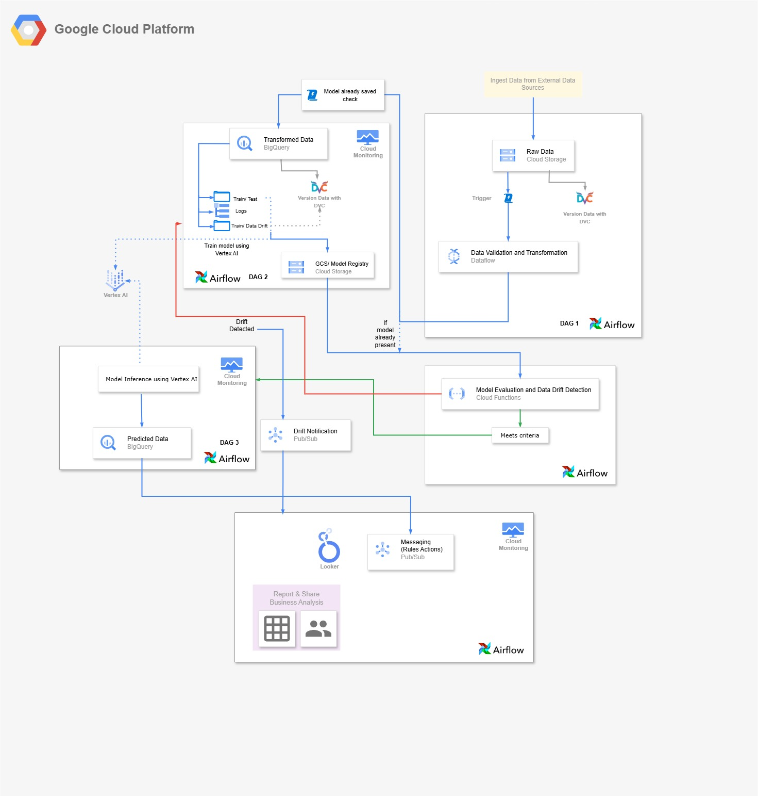

# Telecom Customer Churn and Mobile Device Upgrade Prediction

.png)

DISCLAIMER: 📄✨ Please refer to the document Project_Workflow_with_Screenshots.pdf (available in this repository) for a detailed overview of the complete project workflow with relevant visuals and concise explanations. 🛠️📊

## Table of Contents

1. [Overview](#overview)
2. [Data](#data)
   - [Dataset Information](#dataset-information)
   - [Data Card](#data-card)
3. [Architecture](#architecture)
4. [Project Structure](#project-structure)
5. [Getting Started](#getting-started)
   - [Prerequisites](#prerequisites)
   - [Steps to Set Up and Run the Project](#steps-to-set-up-and-run-the-project)
     - [Step 1: Clone the Repository](#step-1-clone-the-repository)
     - [Step 2: Create a GCS Bucket with Subfolders](#step-2-create-a-gcs-bucket-with-subfolders)
     - [Step 3: Set Up a Cloud Composer Environment](#step-3-set-up-a-cloud-composer-environment)
     - [Step 4: Configure DAGs to Watch for New Data](#step-4-configure-dags-to-watch-for-new-data)
     - [Step 5: Set Up BigQuery for Batch Predictions](#step-5-set-up-bigquery-for-batch-predictions)
6. [Contributors](#contributors)


---

## Overview

The **Telecom Customer Churn and Device Upgrade Prediction** project aims to develop an end-to-end MLOps pipeline capable of forecasting churn and device upgrade events. By leveraging demographic and device-related features, the pipeline identifies customers likely to churn or upgrade, enabling telecom companies to target personalized offers. This solution is designed to enhance customer satisfaction, retention, and revenue growth.

### Objectives:
1. **Churn Prediction**: Identify customers at risk of leaving, enabling proactive retention measures.
2. **Upgrade Prediction**: Pinpoint non-churned customers likely to upgrade their devices soon.

---

## Data

### Dataset Information

The project uses the **Cell2Cell dataset** from the Teradata Center for Customer Relationship Management. Key features include device specifications, demographic attributes, and historical usage patterns. A custom feature, `DeviceUpgrade`, predicts device upgrades for non-churned customers based on criteria such as `CurrentEquipmentDays`.

### Data Card

| Attribute             | Details                                                                 |
|-----------------------|-------------------------------------------------------------------------|
| **Dataset Name**      | Cell2Cell dataset                                                      |
| **Source**            | [Kaggle - Telecom Churn Dataset](https://www.kaggle.com/datasets/jpacse/datasets-for-churn-telecom)  |
| **Size**              | Training: ~51,047 rows, 58 columns<br>Holdout: ~20,000 rows, 58 columns |
| **Data Types**        | Numerical (e.g., CurrentEquipmentDays, Age), Categorical (e.g., CreditRating, IncomeGroup) |
| **Target Variable**   | Churn; Upgrade prediction inferred from `CurrentEquipmentDays`         |

The dataset adheres to privacy regulations, ensuring no Personally Identifiable Information (PII)

---

## Architecture



### Workflow:
1. **Data Ingestion**: Raw data is loaded into Google Cloud Storage.
2. **Data Preprocessing**: Transformation and feature engineering on Airflow DAGs.
3. **Model Training**:
   - Churn prediction using Vertex AI's AutoML.
   - SQL-based device upgrade prediction for non-churned customers.
4. **Model Deployment**: Managed via Vertex AI Model Registry.
5. **Monitoring**: Includes data drift detection, bias analysis, and alerting through GCP Monitoring and Pub/Sub.

---

## Project Structure

```plaintext
TELECOM-DEVICE-UPGRADE-PREDICTION/
│
├── .dvc/                    # DVC configuration files
├── .github/                 # GitHub workflows and templates
├── assets/                  # Project assets (images, diagrams, etc.)
├── data/                    # Raw and processed data
├── Milestone_submissions/   # Files for project milestone submissions
├── ML_Model_DAGs/           # DAGs for ML model orchestration
│   ├── Hold out folder/              # Folder for holdout data
│   ├── airflow_dag_automl.py         # Airflow DAG for AutoML pipeline
│   ├── conversion.py                 # Script for data conversion
│   ├── data_pipeline_gcs.py          # GCS data pipeline script
│   ├── email_cloud_function.py       # Script for triggering email notifications via cloud functions
│   ├── json_converter.py             # JSON conversion utility
│   ├── latest_predictions_dag3.py    # Airflow DAG for latest predictions (DAG 3)
│   ├── train_xgboost.py              # Script for training XGBoost models
│   └── xgboost_docker.dockerfile     # Dockerfile for XGBoost training environment
├── src/                     # Source code for all core functionalities
│   ├── __pycache__/                # Compiled Python files
│   ├── __init__.py                 # Module initialization
│   ├── .gitkeep                   # Placeholder file
│   ├── combined_predictions.sql    # SQL query file for predictions
│   ├── config.py                   # Configuration settings
│   ├── data_loader.py              # Data loading functions
│   ├── data_slicing.py             # Data slicing utilities
│   ├── download_data.py            # Script for downloading data
│   ├── feature_engineering.py      # Feature engineering scripts
│   ├── generate_schema.py          # Schema generation scripts
│   ├── holdout_features.py         # Scripts for holdout feature operations
│   ├── main.py                     # Main script for pipeline execution
│   ├── mlmd_utils.py               # Utilities for ML Metadata management
│   ├── preprocessing.py            # Data preprocessing scripts
│   ├── upload_to_gcs.py            # GCS upload functions
│   ├── utils.py                    # Utility functions
│   └── validate_data.py            # Data validation scripts
├── .dvcignore               # DVC ignore rules
├── .gitignore               # Git ignore rules
├── axial-rigging-*.json     # GCP service account key
├── LICENSE                  # Project license information
├── README.md                # Project overview and setup guide
├── requirements.txt         # Python dependencies
└── test_gcs_auth.py         # GCP authentication test script

```

---

# Getting Started

This guide will walk you through the steps to set up and run the **Telecom Customer Churn and Device Upgrade Prediction** project on Google Cloud Platform (GCP).

---

## Prerequisites

1. **Google Cloud Project**:
   - Ensure you have a GCP project created.
   - Enable the following APIs in the project:
     - Vertex AI API
     - BigQuery API
     - Cloud Storage API
     - Cloud Composer API

2. **Service Account**:
   - Create a service account and assign it the following roles:
     - `Composer Admin`
     - `BigQuery Admin`
     - `Storage Admin`

3. **Access to the Cloned Repository**:
   - Clone the repository: [GitHub Link](https://github.com/MLOPS-Team-7/Telecom-Device-Upgrade-Prediction.git).

---

## Steps to Set Up and Run the Project

### Step 1: Clone the Repository

1. Clone the repository to your local machine:
   ```bash
   git clone https://github.com/MLOPS-Team-7/Telecom-Device-Upgrade-Prediction.git
   cd Telecom-Device-Upgrade-Prediction
   ```
2. Navigate to the cloned folder.

## Step 2: Create a GCS Bucket with Subfolders

### Create a New Bucket:
1. Go to the **Google Cloud Console**.
2. Navigate to **Storage > Buckets**.
3. Click **Create Bucket** and provide the following details:
   - **Name**: Choose a unique name for your bucket.
   - **Region**: Select a region closest to your users or other GCP resources.
   - **Default Storage Class**: Standard.
4. Click **Create**.

### Create Subfolders:
1. Once the bucket is created, click on the bucket name to open it.
2. Use the **Create Folder** button to create the following subfolders:
   - `data/`: For storing dataset files.
   - `modules/`: For storing Python modules.

### Upload Files:
1. **Upload Dataset**:
   - Navigate to the `data/` directory in the cloned project.
   - Upload all dataset files into the `data/` subfolder.
2. **Upload Python Modules**:
   - Navigate to the `src/` directory in the cloned project.
   - Upload all Python module files into the `modules/` subfolder.

---

## Step 3: Set Up a Cloud Composer Environment

### Create a Cloud Composer Environment:
1. In the **Google Cloud Console**, navigate to **Composer > Environments**.
2. Click **Create Environment** and configure the following:
   - **Name**: Provide a name for your environment.
   - **Location**: Choose a region for your Composer environment.
   - **Airflow Version**: Select **Airflow 2.9.3**.
3. Click **Create** (this process may take a few minutes).

### Upload DAG Files:
1. Navigate to the `ML_Model_DAGs/` folder in the cloned repository on your local machine.
2. Compress all files in this folder into a `.zip` file.
3. In the **Google Cloud Console**, navigate to the **DAGs folder** of your Composer environment:
   - Go to **Composer > Environments**.
   - Click on your environment name.
   - Open the **Storage > DAGs folder** link.
4. Use the **Upload Files** button to upload the `.zip` file.
5. Once uploaded, unzip the file directly in the storage interface.

---

## Step 4: Configure DAGs to Watch for New Data

- The DAGs in the project are pre-configured to monitor the `data/` folder in your GCS bucket.
- Whenever new data is added to the `data/` folder, the DAGs will automatically trigger to process it.

---

## Step 5: Set Up BigQuery for Batch Predictions

### Create a BigQuery Dataset:
1. In the **Google Cloud Console**, navigate to **BigQuery**.
2. Click **Create Dataset** and provide the following:
   - **Dataset ID**: A name for your dataset.
   - **Data Location**: Match this with the region of your Composer environment and GCS bucket.
3. Click **Create Dataset**.

### BigQuery View:
- The DAG pipeline will automatically store batch predictions as a **view** in the dataset created.
- This view can be connected to any front-end application (e.g., Looker, Tableau, or a custom dashboard).

By following these steps, you will have a fully automated MLOps pipeline set up on GCP, ready to process data and generate predictions.

---

## Contributors

This project was developed by students from **Northeastern University**:

1. **Aishwarya Satyavolu**  
   - GitHub: [https://github.com/aishwaryasvs](https://github.com/aishwaryasvs)

2. **Nakul Shiledar**  
   - GitHub: [https://www.github.com/NakulShiledar33](https://www.github.com/NakulShiledar33)

3. **Navisha Shetty**  
   - GitHub: [https://github.com/NavishaShetty](https://github.com/NavishaShetty)

4. **Raaga Sindhu Mangalagiri**  
   - GitHub: [https://github.com/raagasindhu99](https://github.com/raagasindhu99)

5. **Shalini Dutta**  
   - GitHub: [https://github.com/ShaliniDutta1801](https://github.com/ShaliniDutta1801)

6. **Venkata Nithya Ala**  
   - GitHub: [https://github.com/NithyaAla](https://github.com/NithyaAla)
---

Feel free to reach out to us via GitHub if you have any questions or suggestions for improving the project!
